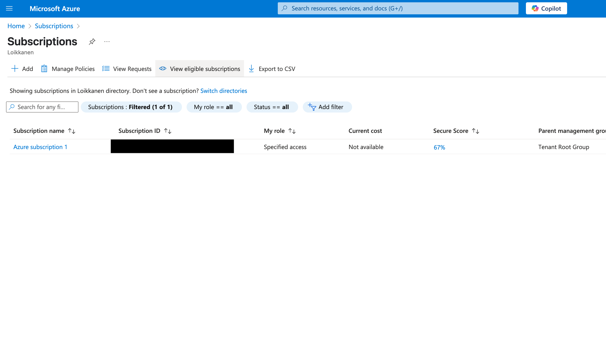
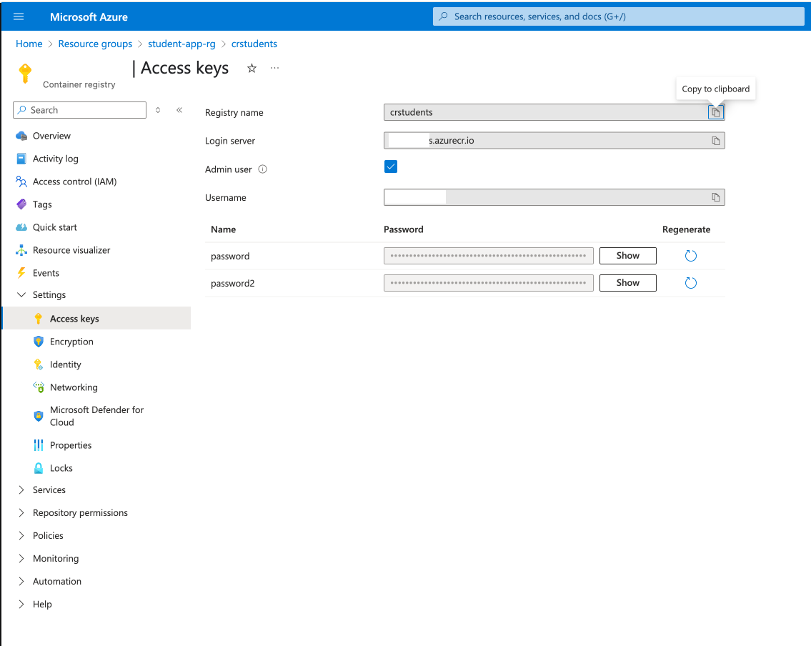
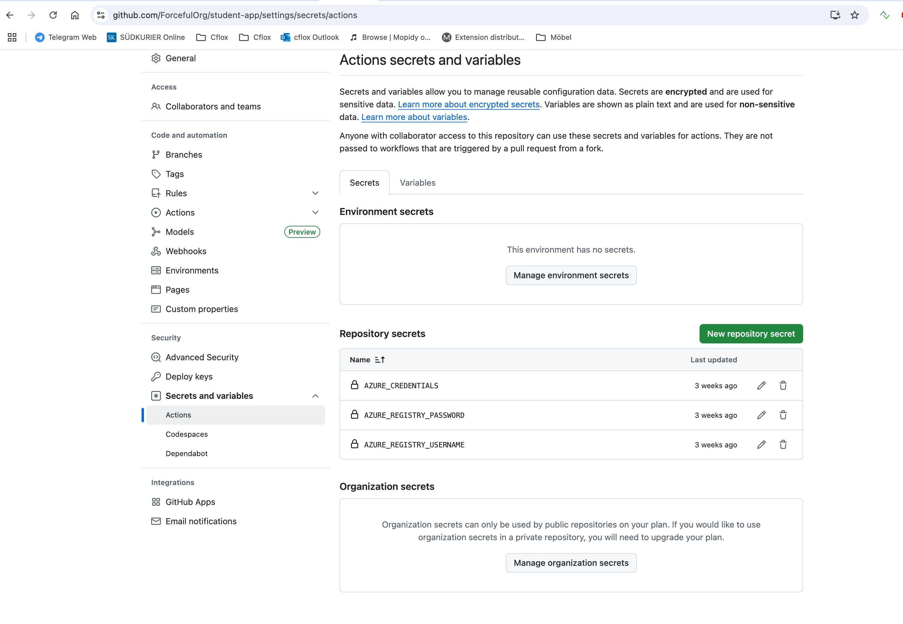
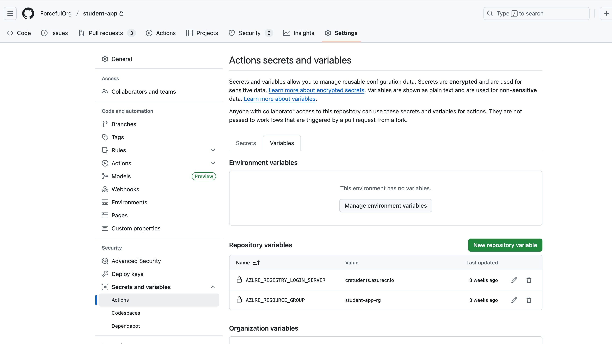

# Student-app for CloudLand 2025 workshop 🚀

This app is a part of "Shipping containers to Azure CloudLand using native tooling" workshop held at CloudLand 2025 by Christian Gläser and Jukka Loikkanen.

## Description 📚

A student management application built with:
- **Backend**: ASP.NET Core 9.0 API with Entity Framework and SQL Server
- **Frontend**: React TypeScript application with modern UI
- **Infrastructure**: Azure-native deployment using Bicep templates

The application allows users to manage student records with full CRUD operations through a responsive web interface.

## How to deploy ⚙️

### 🏗️ Infrastructure Setup (New!)

The repository now includes automated infrastructure deployment using Bicep templates. This creates all necessary Azure resources:

1. **Deploy Infrastructure** (one-time setup):
   - Go to **Actions** → **Deploy Azure Infrastructure**
   - Click **Run workflow** and configure:
     - Environment (dev/staging/prod)
     - Azure region
     - SQL admin credentials
   - The workflow creates all resources with unique names

2. **Update GitHub Settings**:
   After infrastructure deployment, update your repository with the provided values:
   - **Variables**: `AZURE_REGISTRY_LOGIN_SERVER`, `AZURE_RESOURCE_GROUP`
   - **Secrets**: `AZURE_REGISTRY_USERNAME`, `AZURE_REGISTRY_PASSWORD`

3. **Deploy Application**:
   - Push to main/master branch to trigger automatic deployment
   - Or manually run the **Deploy to Azure Web App** workflow

### 📋 Infrastructure Components

- **Container Registry**: Stores Docker images
- **Web Apps**: Frontend (React) and Backend (API) hosting
- **SQL Database**: Student data storage (Basic tier)
- **Storage Account**: Application logging
- **App Service Plan**: Shared hosting plan

For detailed infrastructure documentation, see [`infrastructure-setup/bicep/README.md`](infrastructure-setup/bicep/README.md).

### 🔧 Manual Setup (Legacy)

### Find relevant details:

1. Get Subscription ID and and Registry Access keys





Please note the Username and Password it is required as environment variable AZURE_REGISTRY_PASSWORD and AZURE_REGISTRY_USERNAME

2. Create Service Principal in Azure to connect Github repo and Azure tenant
   https://learn.microsoft.com/en-us/cli/azure/azure-cli-sp-tutorial-1?view=azure-cli-latest&tabs=bash

Relevant script (in Bash format)

```
az ad sp create-for-rbac --name student-app-sp --role contributor --scopes /subscriptions/00000000-0000-0000-0000-000000000000/resourceGroups/myRG1 /subscriptions/00000000-0000-0000-0000-000000000000/resourceGroups/myRG2/providers/Microsoft.Compute/virtualMachines/myVM
```

Output is similar to this:

```
{
"clientId": "uuid-1234-5678-9101-abcdef123456",
"clientSecret": "your-client-secret",
"subscriptionId": "your-subscription-id",
"tenantId": "your-tenant-id",
"activeDirectoryEndpointUrl": "https://login.microsoftonline.com",
"resourceManagerEndpointUrl": "https://management.azure.com/",
"activeDirectoryGraphResourceId": "https://graph.windows.net/",
"sqlManagementEndpointUrl": "https://management.core.windows.net:8443/",
"galleryEndpointUrl": "https://gallery.azure.com/",
"managementEndpointUrl": "https://management.core.windows.net/"
}
```

Please copy the output, it contains the relevant details for the AZURE_CREDENTIALS environment secret

2. Grant Service Principal permissions to Resource Group (either through script or in Azure Portal)

Environment variables secrets needed:
AZURE_CREDENTIALS - Output from Bash script, see above
AZURE_REGISTRY_PASSWORD - your-password from registry
AZURE_REGISTRY_USERNAME - your username from the registry



[Github Actions Variables](/student-app/settings/variables/actions)
AZURE_REGISTRY_LOGIN_SERVER - The name of the container registry being used, e.g. student-app-cr.azurecr.io
AZURE_RESOURCE_GROUP - The resource group name, e.g. learn-to-build-rg


